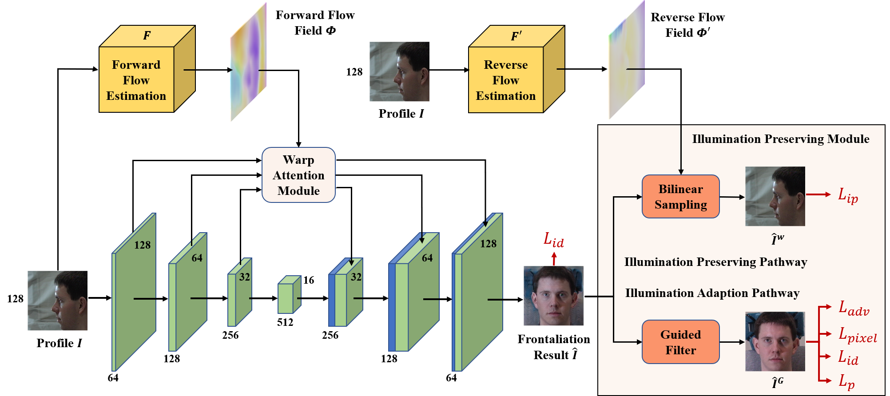

# [Learning Flow-based Feature Warping For Face Frontalization with Illumination Inconsistent Supervision](./)

The source code for our paper "Learning Flow-based Feature Warping For Face Frontalization with Illumination Inconsistent Supervision" (ECCV 2020)

## Quick Start

### Installation

**Prerequisites**
    
    - python3.7
    - pytorch1.5.0 + torchvision0.6.0
    - CUDA
    - opencv-python
    - numpy
    - tensorboardX
    - tqdm
    
**Conda installation**

    # 1. Create a conda virtual environment.
    conda create -n ffwm python=3.7 anaconda
    source activate ffwm
    
    # 2. Install the pytorch 
    conda install pytorch==1.5.0 torchvision==0.6.0 cudatoolkit=9.2 -c pytorch
    
    # 3. Install dependency
    pip install -r requirement.txt
    
    # 4. Build pytorch Custom CUDA Extensions, we have tested it on pytorch1.5.0+cu92
    bash setup.sh

### Data Preparation

You can use the scripts in [data_process](./data_process) to prepare your data.

The data folder is structured as follows:

    dataset
        ├── multipie
        │       ├── train
        │       │     ├── images
        │       │     ├── masks
        │       │     └── landmarks.npy
        │       └── test
        │             ├── images
        │             ├── gallery_list.npy (optional)
        │             └── visual_list.npy (optional)
        └── lfw
             ├── images
             └── pairs.txt

Our test `gallery_list.npy` and `visual_list.npy` can download from [GoogleDrive](https://drive.google.com/drive/folders/1U26FvuLtXraxPrRNxCxFka3DOvRuG4NW?usp=sharing) or [BaiduNetDisk](https://pan.baidu.com/s/1X62Atd9Q_USs0aGQk3WllA)(l98p).

### Testing

Download the models from [GoogleDrive](https://drive.google.com/drive/folders/1U26FvuLtXraxPrRNxCxFka3DOvRuG4NW?usp=sharing) or [BaiduNetDisk](https://pan.baidu.com/s/1X62Atd9Q_USs0aGQk3WllA)(l98p) to `./checkpoints` folder or use your pretrained models. The models are structured as follows:

    ./checkpoints
          ├── ffwm
          │       ├── latest_net_flowNetF.pth
          │       └── latest_net_netG.pth
          ├── lightCNN_10_checkpoint.pth (pretrained)
          └── LightCNN_29Layers_checkpoint.pth (original)

**Test on MultiPIE**

    python test_ffwm.py \
                --dataroot path/to/dataset \
                --lightcnn path/to/pretrained lightcnn \
                --preload 
    
**Test on LFW** 

    python test_ffwm.py \
                --datamode lfw \
                --dataroot path/to/dataset \
                --lightcnn path/to/pretrained lightcnn \
                --preload 

### Training

**1. Finetune LightCNN**

    cd lightcnn
    python finetune.py \
                --save_path ../checkpoints/ \
                --dataroot path/to/dataset/multipie \
                --model_path path/to/original lightcnn \
                --preload
    
You can download the original LightCNN model from [LightCNN](https://github.com/AlfredXiangWu/LightCNN). Or you can download the original and our pretrained LightCNN from [GoogleDrive](https://drive.google.com/drive/folders/1U26FvuLtXraxPrRNxCxFka3DOvRuG4NW?usp=sharing) or [BaiduNetDisk](https://pan.baidu.com/s/1X62Atd9Q_USs0aGQk3WllA)(l98p).

**2. Train Forward FlowNet**

    python train_flow.py \
                --model flownet \
                --dataroot path/to/dataset \
                --aug \
                --preload \
                --name flownetf \
                --batch_size 6

**3. Train Reverse FlowNet**

    python train_flow.py \
                --model flownet \
                --reverse \
                --dataroot path/to/dataset \
                --aug \
                --preload \
                --name flownetb \
                --batch_size 6

**4. Train FFWM**

    python train_ffwm.py \
                    --name ffwm  \
                    --preload \
                    --dataroot path/to/dataset \
                    --lightcnn path/to/pretrained lightcnn 

## Citation
 
If you find our work useful in your research or publication, please cite:
 
    @InProceedings{wei2020ffwm,
      author = {Wei, Yuxiang and Liu, Ming and Wang Haolin and Zhu, Ruifeng and Hu, Guosheng and Zuo, Wangmeng},
      title = {Learning Flow-based Feature Warping For Face Frontalization with Illumination Inconsistent Supervision},
      booktitle = {Proceedings of the European Conference on Computer Vision},
      year = {2020}
    }
